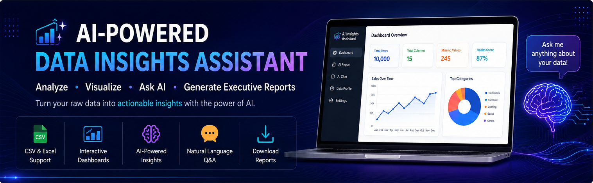
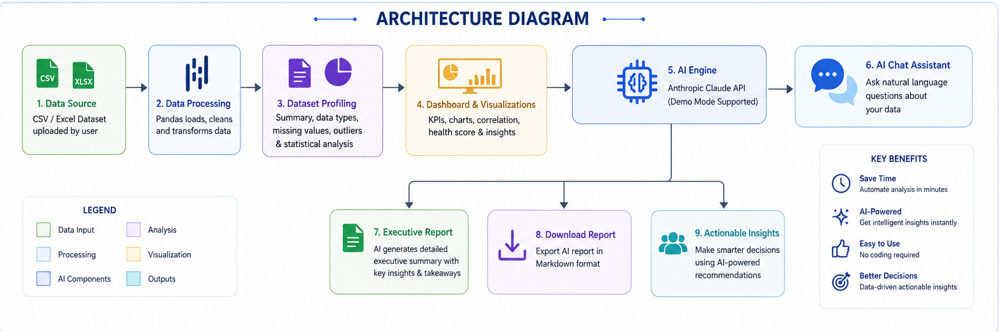
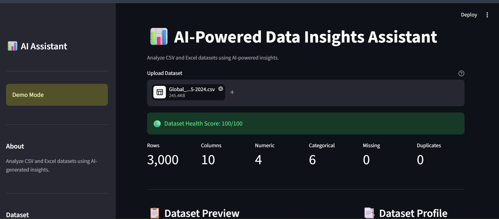
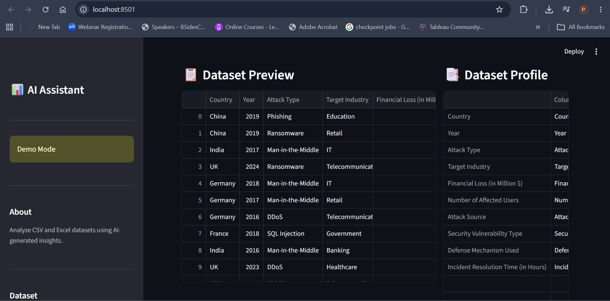
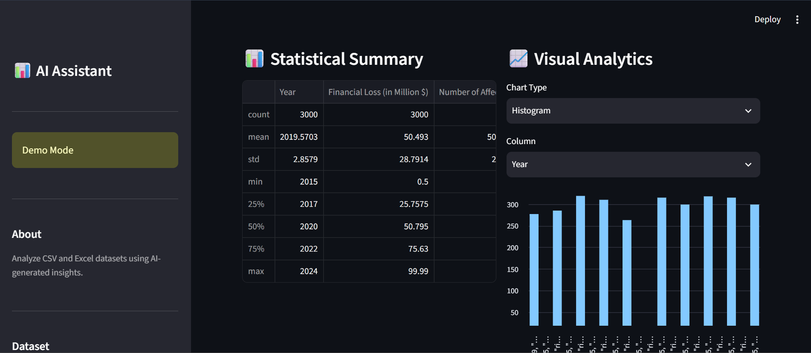
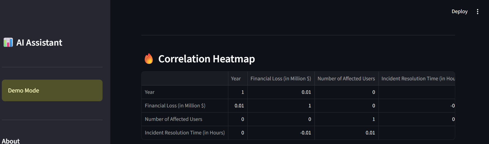
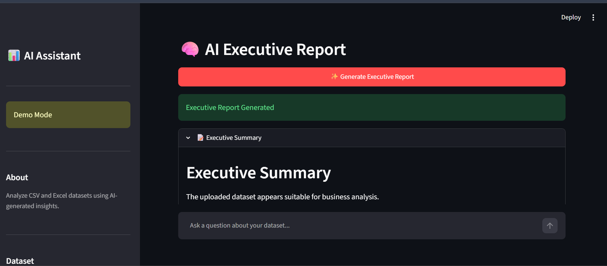
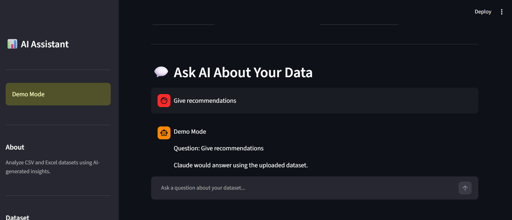

<p align="center">
  
</p>

<h1 align="center">📊 AI-Powered Data Insights Assistant</h1>

<p align="center">
An AI-powered business intelligence dashboard that transforms CSV and Excel datasets into interactive analytics, executive reports, and natural language conversations using <strong>Anthropic Claude AI</strong>.
</p>

<p align="center">


</p>

---

# 📑 Table of Contents

- [Overview](#-overview)
- [Key Features](#-key-features)
- [Technology Stack](#-technology-stack)
- [Architecture](#-architecture)
- [Application Preview](#-application-preview)
- [Installation](#-installation)
- [Project Structure](#-project-structure)
- [Future Enhancements](#-future-enhancements)
- [Author](#-author)
- [License](#-license)

---

# 🌟 Overview

**AI-Powered Data Insights Assistant** is a modern analytics application built using **Python**, **Streamlit**, **Pandas**, and **Anthropic Claude AI**.

The application enables users to upload CSV or Excel datasets and instantly generate:

- 📊 Interactive dashboards
- 📈 Statistical summaries
- ❤️ Dataset health metrics
- 🤖 AI-generated executive reports
- 💬 Natural language answers about the uploaded data

This project demonstrates practical skills in **Python development, AI integration, business intelligence, dashboard design, and data analysis**.

---

# ✨ Key Features

- 📂 CSV & Excel Upload
- 📊 KPI Dashboard
- ❤️ Dataset Health Score
- 📋 Automatic Dataset Profiling
- 📈 Statistical Summary
- 📉 Interactive Visualizations
- 🔥 Correlation Analysis
- 🤖 AI Executive Report
- 💬 AI Chat Assistant
- 📥 Report Download
- 🧪 Demo Mode (No API Credits Required)

---

# 🚀 Technology Stack

| Category | Technology |
|-----------|------------|
| Language | Python |
| Framework | Streamlit |
| Data Processing | Pandas |
| AI | Anthropic Claude API |
| Environment | python-dotenv |
| Spreadsheet Support | OpenPyXL |
| Version Control | Git & GitHub |

---

# 🏗 Architecture

<p align="center">

</p>

---

# 🖼 Application Preview

## 📊 Dashboard Overview

<p align="center">

</p>

Displays key performance indicators, dataset health score, and high-level business metrics.

---

## 📂 Dataset Preview

<p align="center">

</p>

Preview uploaded data and inspect column types, missing values, and structure.

---

## 📈 Analytics Dashboard

<p align="center">

</p>

Explore descriptive statistics and interactive visualizations.

---

## 🔥 Correlation Analysis

<p align="center">

</p>

Analyze relationships between numerical features to identify trends and dependencies.

---

## 🤖 AI Executive Report

<p align="center">

</p>

Generate concise executive summaries, key findings, risks, and recommendations using AI.

---

## 💬 AI Chat Assistant

<p align="center">

</p>

Ask natural language questions about the uploaded dataset and receive AI-powered responses.

---

# ⚙️ Installation

## Clone the Repository

```bash
git clone https://github.com/poojan644/ai-powered-data-insights-assistant.git

cd ai-powered-data-insights-assistant
```

## Install Dependencies

```bash
pip install -r requirements.txt
```

## Configure API Key

Create a `.env` file:

```text
ANTHROPIC_API_KEY=your_api_key_here
```

If you don't have Anthropic API credits:

```python
DEMO_MODE = True
```

## Run the Application

```bash
streamlit run app.py
```

---

# 📂 Project Structure

```text
ai-powered-data-insights-assistant/
│
├── app.py
├── README.md
├── requirements.txt
├── LICENSE
├── .gitignore
├── .env.example
│
├── sample_data/
│     └── sample_sales_data.csv
│
└── screenshots/
      ├── banner.png
      ├── architecture.png
      ├── dashboard.png
      ├── datasetpreview.png
      ├── analytics.png
      ├── correlationheatmap.png
      ├── executive-report.png
      └── chat-assistant.png
```

---

# 🔮 Future Enhancements

- Interactive Plotly visualizations
- Correlation heatmaps with color gradients
- PDF report export
- Predictive analytics
- Time-series forecasting
- Azure App Service deployment
- Docker containerization
- User authentication
- Dark mode support

---

# 👩‍💻 Author

## **Pooja Borade**

**Microsoft Certified**

- ☁️ Azure Solutions Architect Expert
- ☁️ Azure Administrator Associate
- ☁️ Azure Fundamentals

### Areas of Interest

- Cloud Engineering
- AI Engineering
- Data Analytics
- Business Intelligence
- Systems Administration

GitHub:

https://github.com/poojan644

---

# 📄 License

This project is licensed under the **MIT License**.

---

<p align="center">

⭐ If you found this project useful, please consider giving it a star.

</p>
